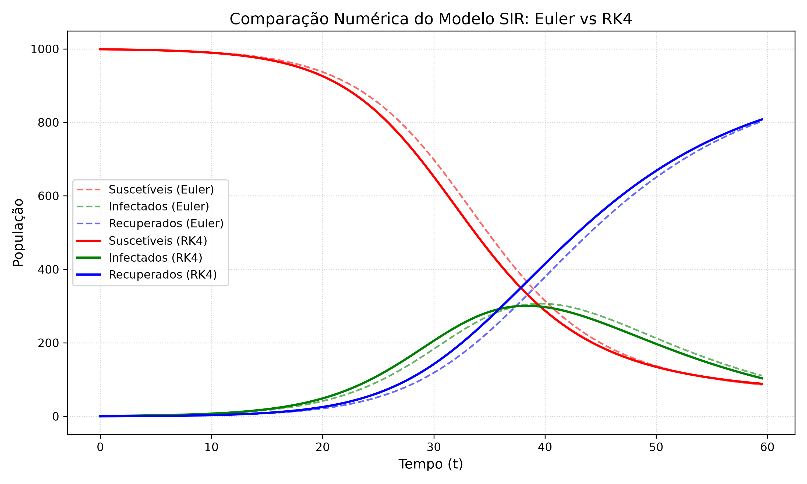

# Cálculo Numérico P1

Projeto desenvolvido para a disciplina de Cálculo Numérico (2026.1) da Universidade Federal do Maranhão (UFMA).

## Integrantes

* Gabriel Santos Freitas
* Kely Souza da Silva
* Milene Mota Alves

## Objetivo

Desenvolver e implementar métodos numéricos estudados na disciplina de Cálculo Numérico utilizando Python, aplicando técnicas de interpolação, ajuste de curvas e integração numérica para resolução de problemas práticos.

## Métodos Numéricos

### Interpolação

* Interpolação de Lagrange
* Interpolação de Gregory-Newton
* Spline Linear
* Spline Cúbica Natural

### Ajuste de Curvas

* Método dos Mínimos Quadrados (MMQ)

### Integração Numérica

* Regra dos Trapézios
* Regra 1/3 de Simpson
* Regra 3/8 de Simpson (Newton-Cotes)
* Quadratura de Gauss

## Estrutura do Projeto

#### calculo-numericoP1

├── interpolacao

│   ├── lagrange.py

│   ├── gregory_newton.py

│   ├── spline_linear.py

│   └── spline_cubica.py

├── integracao

│   └── trapezios.py

├── mmq

│   └── mmq.py

├── .github/
│   └── workflows/

├── main.py

└── README.md

## Tecnologias Utilizadas

* Python 3
* Visual Studio Code
* Git
* GitHub

## Status do Projeto

### Métodos concluídos

* ✅ Interpolação de Lagrange
* ✅ Interpolação de Gregory-Newton
* ✅ Spline Linear
* ✅ Spline Cúbica Natural
* ✅ Método dos Mínimos Quadrados (MMQ)
* ✅ Regra dos Trapézios
* ✅ Regra 1/3 de Simpson
* ✅ Regra 3/8 de Simpson (Newton-Cotes)
* ✅ Quadratura de Gauss (FQG)

## Resultado da Simulação Unidade3

O gráfico abaixo apresenta a comparação entre os métodos de Euler e Runge-Kutta de 4ª ordem (RK4) aplicados ao modelo epidemiológico SIR.

Observa-se que o método RK4 fornece uma aproximação mais precisa da evolução das populações suscetível, infectada e recuperada.

## ⚙ Execução automática

Este projeto utiliza GitHub Actions para executar automaticamente todos os algoritmos a cada atualização enviada para o repositório.